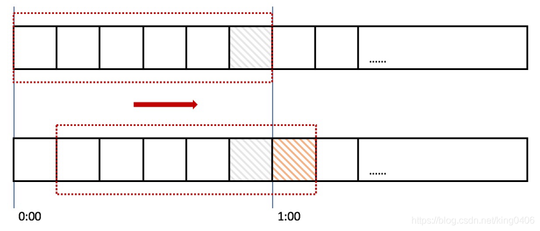

### java实现滑动时间窗口算法
本文实现了一种基于java的滑动时间窗口计数器算法

#### 滑动时间窗口计数器算法思想：
针对固定时间算法会在临界点存在瞬间大流量冲击的场景，
滑动时间窗口计数器算法应运而生。它将时间窗口划分为更小的时间片段，每过一个时间片段，
我们的时间窗口就会往右滑动一格，每个时间片段都有独立的计数器。我们在计算整个时间窗口内的
请求总数时会累加所有的时间片段内的计数器。时间窗口划分的越细，那么滑动窗口的滚动就越平滑，
限流的统计就会越精确。

#### 本文代码逻辑：
新建一个本地缓存，每5s为一个时间窗口，每1s为一个时间片段，时间片段作为缓存的key，
原子类计数器作为缓存的value。每秒发送随机数量的请求，计算每个时间片段的前5秒内的累加请求数量，超出阈值则限流。

